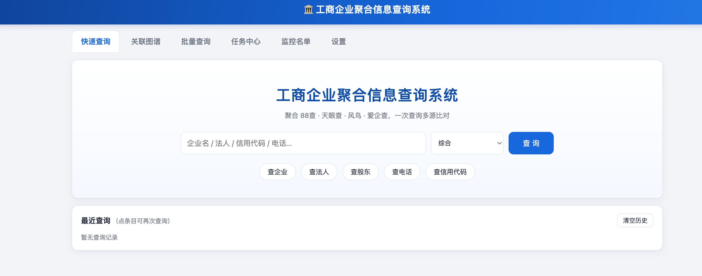
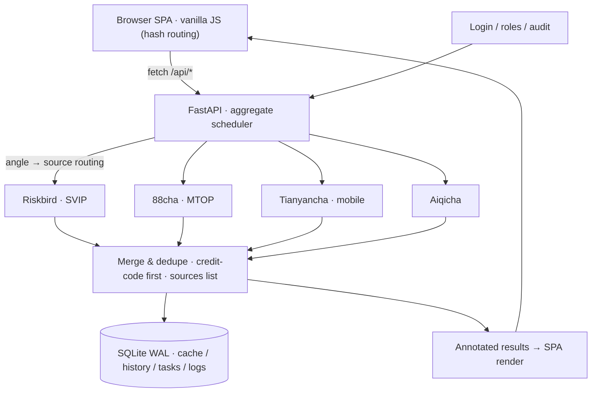
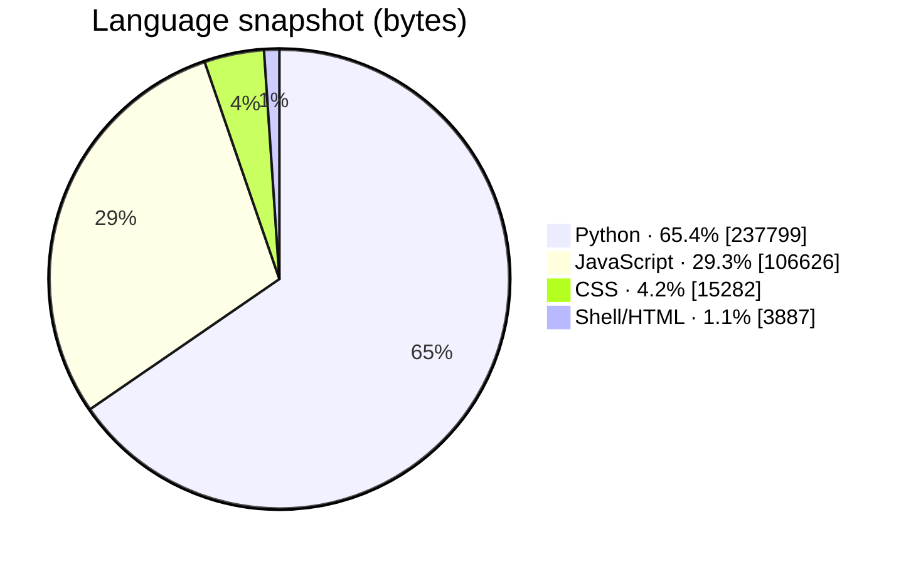
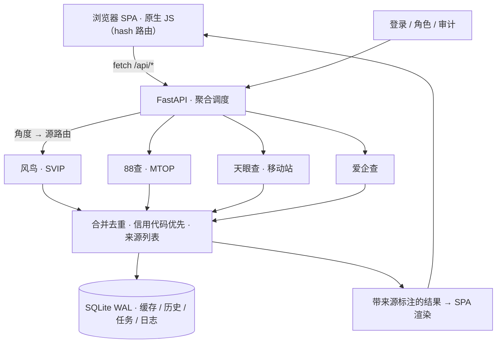
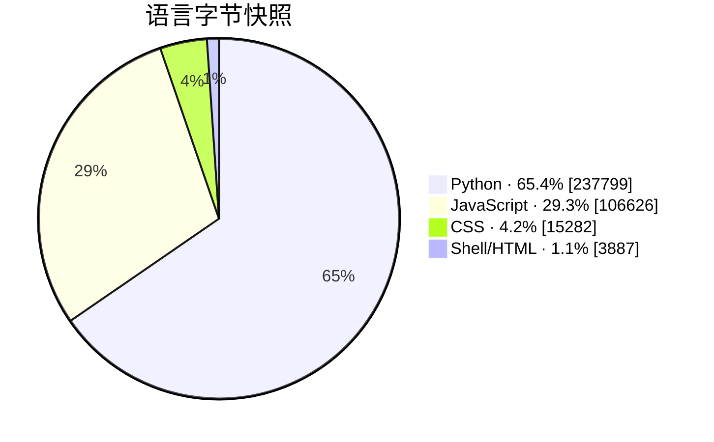

# Business Registry Query System

<div align="center">

**工商企业聚合信息查询系统 · Business Registry Query System**

A self-hosted aggregated China business-registry lookup platform — 88cha · Tianyancha · Riskbird · Aiqicha queried in parallel, merged and deduplicated automatically, with every field annotated by its source.

[](https://github.com/smthdagg/business-registry-query/actions/workflows/ci.yml)
[](LICENSE)
[](requirements.txt)
[](requirements.txt)
[](docker-compose.yml)
[](https://github.com/smthdagg/business-registry-query/stargazers)

[English Guide](docs/USER_GUIDE_EN.md) · [中文完整教程](docs/USER_GUIDE_ZH.md) · [Security Policy](SECURITY.md) · [License](LICENSE)

</div>

> [!IMPORTANT]
> This project is a **personal-use** tool. All data comes from information that third-party platforms display publicly; respect each platform's terms of service and robots policies, and keep the built-in request pacing intact. Do not deploy it to the public internet without a password (and ideally a reverse proxy with HTTPS). It is not a data-resale product, and you are responsible for how you use it.



---

## English

## Introduction

Business Registry Query System turns four separate lookup websites into one query:

1. **Aggregated search** fans a keyword out to 88cha, Tianyancha, Riskbird and Aiqicha in parallel, then merges the answers: records are normalized by unified social credit code (company name as fallback), duplicate companies get field-level completion, and every row carries a `sources` list.
2. **Boss search** returns *people*, not company noise — Riskbird person records precisely separate same-name individuals by `personId`, filterable by the province of their companies, and each person opens into all their companies with roles and stakes.
3. **Company profiles, relation graph, batch queries, watchlist, history and an admin audit log** sit on top, with a Tianyancha-style UI that requires no build step.

The core boundary of the project is "**parallel, traceable, honest**": a failing source never breaks the response — its chip reports the real reason (no cookie, quota, risk control) — and no source is ever fabricated to look successful.

## Features

- Six search angles: comprehensive / company name / legal rep / shareholder / credit code / phone, with per-angle source routing so unused sources are not burned.
- Four-source aggregation with credit-code-first merge, field-level completion and per-row source annotation.
- Boss search via Riskbird person records: same-name grouping (independent personId), server-side province filtering (regionId, e.g. 340000 = Anhui), one-click "all companies" with roles and stake percentages.
- Company profiles mirroring Tianyancha sections: basic info / shareholders (with stake %) / key personnel / outward investment / branches, cross-source completed.
- Canvas force-directed relation graph: legal rep, shareholder, executive, investment and branch relations, multi-hop with budgets (depth ≤ 3, nodes ≤ 60), per-node source tracking.
- Cascading result filters: province → city, industry section → category, registration status.
- Batch queries (≤ 500 lines, angle prefixes) in a background queue with progress and cancel; CSV / XLSX / JSON export with formula-injection protection.
- Watchlist with one-click re-check and change counters; query history; admin-only audit log.
- Role separation (admin / member): PBKDF2-SHA256 (200k iterations) passwords, HMAC-SHA256 signed sessions, login lockout after 5 failures.
- Cookie management live in the web UI — Netscape / JSON / header-string / cURL file imports auto-detected — plus a background keep-alive loop.
- Optional Camoufox fingerprint-browser fallback for risk control (off by default); Docker compose deployment with a data volume that survives rebuilds.

## How it works



A typical search goes through these steps:

1. The SPA sends one request with keyword, angle, optional person name and province code.
2. The scheduler routes the angle to the sources that support it and fans them out in parallel; per-source pacing is respected and one failing source never affects the others.
3. Each adapter normalizes its payload into a shared record schema (company or person entry).
4. The merger deduplicates by unified social credit code (company name fallback), completes missing fields from lower-priority sources, and attaches a `sources` list.
5. Person-type rows (👤) are matched by name through the person-hit filter so that "company name contains the person's name" noise is removed.
6. Results are cached (`source|angle|keyword|person|region|limit`), logged to history, and rendered with per-source chips and cascading filters.

Deeper usage detail: [Complete User Guide (English)](docs/USER_GUIDE_EN.md) and [中文完整教程](docs/USER_GUIDE_ZH.md).

## Implementation

| Layer | Implementation | Key constraints |
|---|---|---|
| Web UI | vanilla-JS SPA, hash routing, Canvas force graph | no build step; no-cache headers on assets |
| API | FastAPI + Uvicorn | login enforced when a password is seeded; settings/logs admin-only |
| Aggregation | per-angle thread-pool fan-out | per-source failure isolation; priority merge Riskbird > 88cha > Tianyancha > Aiqicha |
| Merge & dedupe | credit-code-first identity, field-level completion | every record carries a `sources` list |
| Source adapters | 4 live sources + 1 mock, uniform angles/strategies/interval contract | polite pacing; 88cha MTOP token auto-retry; quota/risk-control reasons surfaced as-is |
| Boss semantics | Riskbird `persons/search` personId grouping; server-side regionId | same-name individuals never conflated; single group auto-redirects |
| Relation graph | budgeted BFS expansion | depth ≤ 3, nodes ≤ 60, invest self-loop guard |
| Persistence | SQLite (WAL mode) | cache keys include angle/person/region/limit |
| Security | PBKDF2-SHA256 (200k), HMAC-SHA256 sessions, login throttle | secrets only in `.env` / `data/` (git-ignored) |
| Export | openpyxl / CSV / JSON | formula-injection neutralization on every cell |
| Deploy | Docker compose | `./data` volume survives rebuilds; CN registry mirrors documented |

## Support and validation status

"Runs" is not the same as "verified with real cookies on real infrastructure". The table separates the evidence levels:

| Environment | Arch | Evidence | Status |
|---|---|---|---|
| Local development (macOS) | Apple Silicon · Docker Desktop | image build, container smoke test (health/index/cookies), full pytest suite | **Passed** |
| Tencent Cloud VPS · Ubuntu 26.04 | x86_64 | docker compose deploy, admin login, live Riskbird boss search (a common two-character name + Anhui → 18 same-name person groups), domain + port 80/8080 access | **Live-passed** |
| Browser end-to-end | Chromium | login → boss search → filters → person companies, real form interaction | **Passed** |
| Other hosts / browsers | — | no evidence yet | **Not verified** |

63 automated tests cover aggregation merge & dedupe, the relation-graph engine, batch task flow, mocked source adapters, cookie import, accounts and profile services, and utility helpers.

## Installation

### Prerequisites

- Python 3.12 (or Docker); for mainland-China VPS, configure Docker registry mirrors first (`/etc/docker/daemon.json` → `registry-mirrors`) since Docker Hub direct access is unreliable.
- At least one source cookie for real data — without any cookie the built-in mock source still demonstrates the full UX with fictional data.
- A password in `.env` if the service is reachable beyond localhost.

### 1. Run locally

```bash
uv venv && uv pip install -r requirements.txt
cp .env.example .env          # fill in cookies / ADMIN_PASSWORD
.venv/bin/uvicorn app.main:app --host 127.0.0.1 --port 8000
# open http://127.0.0.1:8000
```

### 2. Run with Docker

```bash
cp .env.example .env
docker compose up -d --build
# open http://127.0.0.1:8000 — data persists in ./data
```

### 3. Deploy to a VPS

```bash
rsync -av --exclude .venv --exclude data/app.db* --exclude .git \
      --exclude __pycache__ --exclude tests \
      app scripts requirements.txt Dockerfile docker-compose.yml .env.example \
      user@your-vps:~/business-query/
ssh user@your-vps
cd ~/business-query && cp .env.example .env && nano .env
sudo docker compose up -d --build
```

Open the port in your cloud security group; for production put Nginx/Caddy in front and enable HTTPS.

## Usage order

Configure in this order to avoid mixing credential and query problems:

1. Log in as admin and change the password (**Settings → Change password**).
2. Import or paste cookies in **Settings → Sources & Cookies** — Riskbird first (richest fields), then Tianyancha / 88cha / Aiqicha.
3. Run the **connectivity probe** per source and confirm the sample results.
4. Run a comprehensive search; read the per-source chips, then try the cascading filters.
5. Boss search: name + province → same-name person groups → one person's companies with roles.
6. Open a company profile, then **View in graph** for the relation map.
7. Batch-query your keyword list and export CSV / XLSX / JSON.
8. Put key companies on the **watchlist**; review the audit log as needed.

Step-by-step guides:

- [Complete User Guide (English)](docs/USER_GUIDE_EN.md)
- [中文完整使用教程](docs/USER_GUIDE_ZH.md)

## Running tests

```bash
pip install -r requirements-dev.txt
python -m pytest tests/ -q
# 63 passed
```

CI runs the same suite plus a secret scan on every push (see [.github/workflows/ci.yml](.github/workflows/ci.yml)): any cookie-like string tracked in the repository fails the build.

## Language composition

A byte snapshot of the current main branch (2026-09-13). Python carries the API, aggregation and adapters; JavaScript drives the whole SPA; CSS and shell are glue.



> Numbers drift as main updates; docs and generated files depend on GitHub Linguist rules.

## Project structure

```text
app/
  main.py                 FastAPI entry, lifespan, static mounting
  auth.py                 login / sessions / throttle / roles
  routes.py               search / profile / person / watchlist / batch / admin routes
  config.py               .env loading and defaults
  db.py                   SQLite (WAL): users, cache, history, tasks, watchlist, logs
  sources/                88cha, Tianyancha, Riskbird, Aiqicha, mock + cookie store
  services/               aggregate, search, relation, profile, worker, exporter, pacing
  static/                 SPA (main.js, graph.js, styles) — no build step
scripts/
  ctl.sh                  start / stop / restart / status / reset-pw
  import_cookies.py       Netscape cookie file importer
tests/                    63 pytest cases (mocked sources, e2e task flow)
docs/                     bilingual user guides + screenshots
```

## Security, privacy, and compliance

- Cookies, passwords and server details live only in `.env` and `data/` — both git-ignored; CI fails on cookie-like strings in tracked files.
- Passwords are PBKDF2-SHA256 (200k iterations); sessions are HMAC-signed, HttpOnly, SameSite=Lax; logins lock out after 5 failures; the audit log records failures and lockouts.
- Exports neutralize spreadsheet formula injection; requests carry per-source polite pacing.
- Query data may contain personal information — do not publish screenshots or exports containing real records; report vulnerabilities privately via [SECURITY.md](SECURITY.md).

## Notes & gotchas

These come from the working model above (parallel source fan-out → merge → SPA), not theory. Each was hit in real testing.

- **Tianyancha's 5-per-page limit is hard.** The mobile interface returns five rows per page; this project does not bypass it — it aggregates other sources around it. Don't judge "only 5 results" as a bug.
- **Aiqicha's logged-in search can return empty.** After a site change the endpoint may answer 200 with an empty list for logged-in cookies. The system surfaces this honestly in the source chips instead of hiding the source or faking rows.
- **88cha's MTOP token expires mid-session.** The `_m_h5_tk` cookie drives request signing; when the API answers `TOKEN_EXPIRED`, the adapter re-signs with the fresh token and syncs it back into the Cookie header automatically — otherwise every retry fails forever.
- **Riskbird's person-companies API is picky.** `personEachData` requires a form-encoded POST (a JSON body silently fails) and a session `orderNo` scraped from the person page's SSR HTML (`WEB20\d{12,}`); without it the endpoint returns nothing that looks like an auth error.
- **Province filters need codes, not names.** Riskbird `regionId` expects `340000`; passing "Anhui"/"安徽" returns zero results. The UI normalizes full names, short names and codes before calling the API — an earlier version passed the raw string through and silently degraded to the fallback view.
- **Person rows need person-aware filtering.** Person entries carry `matchType = 人员（风鸟）`; a person-hit filter that only checks company fields drops every person row. This exact bug shipped once: the boss-search fallback view collapsed to company-only rows and looked like "the system finds only one person".
- **Masked phone numbers are not phone numbers.** Tianyancha returns `189****1234`-style strings; treating them as equal creates false same-phone relations. The comparator rejects any masked value outright.

## Contributing

This is primarily a personal tool, but issues and reproducible bug reports are welcome:

1. Check the existing issues first; include source chip states and (sanitized) request context;
2. Add or adjust a test with your change (`tests/`);
3. Run `python -m pytest tests/ -q`;
4. Never commit cookies, passwords, server details or real query data.

## License

This project is licensed under the [MIT License](LICENSE). Third-party data remains under the respective platforms' terms; this repository ships no data and no credentials.

---

## 中文

## 项目简介

工商企业聚合信息查询系统把四个互相独立的查询网站整合成一次查询：

1. **聚合搜索**把关键词并行打向 88查、天眼查、风鸟、爱企查，再合并结果：记录按统一社会信用代码归一（退化为企业名），重复企业做字段级互补，每行携带 `sources` 来源列表。
2. **查老板**返回的是**人**而不是公司噪声——风鸟人员档案按独立 `personId` 精确区分同名人员，支持按任职企业所在省份筛选，点选即可查看名下全部企业（含职务与持股比例）。
3. **公司档案、关联图谱、批量查询、监控名单、查询历史与管理员审计日志**构建其上，界面参照天眼查交互重写，前端零构建依赖。

项目的核心边界是“**并行、可溯、诚实**”：任何单源失败都不会拖垮整体响应——它的芯片如实报告原因（无 Cookie / 配额用尽 / 风控），绝不伪造“查询成功”。

## 主要能力

- 六角度搜索：综合 / 企业名 / 法人 / 股东 / 信用代码 / 电话，按角度路由数据源，不白烧无关源配额。
- 四源聚合：信用代码优先合并、字段级互补、逐行来源标注。
- 查老板走风鸟人员档案：同名分组（独立 personId）、服务端省份筛选（regionId，如 340000=安徽）、一键查看名下企业（职务 + 持股比例）。
- 公司档案与天眼查分区同构：基本信息 / 股东（比例）/ 主要人员 / 对外投资 / 分支机构，跨源互补。
- Canvas 力导向关联图谱：法人、股东、高管、投资、分支五类关系，多跳预算展开（深度 ≤ 3、节点 ≤ 60），按节点记源。
- 结果页级联筛选：省 → 市、行业门类 → 细类、经营状态。
- 批量查询（≤ 500 行、角度前缀）后台队列执行，可看进度、可取消；CSV / XLSX / JSON 导出带公式注入防护。
- 监控名单一键复查与变化计数；查询历史；仅管理员可见的操作日志。
- 角色分离（管理员/会员）：PBKDF2-SHA256（20 万次迭代）口令哈希、HMAC-SHA256 签名会话、连续 5 次失败锁定。
- Cookie 网页端在线管理——Netscape / JSON / Header / cURL 四种文件格式自动识别导入——并带后台保活循环。
- 可选 Camoufox 指纹浏览器风控降级（默认关闭）；Docker compose 部署，数据卷跨重建保留。

## 工作原理



一次典型查询经历以下步骤：

1. SPA 发出一次请求，携带关键词、角度、可选人名与省份代码。
2. 调度层按角度路由到支持的源并并行发出；遵守各源最小间隔，单源失败互不影响。
3. 各适配器把返回载荷归一为统一记录模式（公司条目或人员条目）。
4. 合并层按统一社会信用代码去重（退化为企业名），用低优先级源补全缺失字段，并附加 `sources` 列表。
5. 人员行（👤）经人名命中过滤校验，“公司名里含人名”的噪声被剔除。
6. 结果写入缓存（键含 `源|角度|关键词|人名|省代码|条数`）、记入历史，随后带源芯片与级联筛选渲染。

更详细的使用说明：[中文完整教程](docs/USER_GUIDE_ZH.md) 与 [Complete User Guide (English)](docs/USER_GUIDE_EN.md)。

## 技术实现

| 层级 | 实现 | 关键约束 |
|---|---|---|
| Web UI | 原生 JS SPA、hash 路由、Canvas 力导向图 | 零构建依赖；静态资源下发 no-cache 头 |
| API | FastAPI + Uvicorn | 播种口令后强制登录；设置与日志仅管理员 |
| 聚合 | 按角度线程池并行扇出 | 单源失败隔离；优先级合并 风鸟 > 88查 > 天眼查 > 爱企查 |
| 合并去重 | 信用代码优先归一 + 字段级互补 | 每条记录携带 `sources` 列表 |
| 数据源适配 | 4 个真实源 + 1 个 Mock，统一 angles/strategies/interval 契约 | 礼貌间隔；88查 MTOP token 自动重试；配额/风控原因如实呈现 |
| 查老板语义 | 风鸟 `persons/search` personId 分组；服务端 regionId | 同名不混淆；唯一分组自动直达 |
| 关联图谱 | 预算化 BFS 展开 | 深度 ≤ 3、节点 ≤ 60、投资自环防御 |
| 持久化 | SQLite（WAL 模式） | 缓存键含角度/人名/省份/条数 |
| 安全 | PBKDF2-SHA256（20 万次）、HMAC 会话、登录限速 | 敏感凭据只存 `.env` / `data/`（已 git-ignore） |
| 导出 | openpyxl / CSV / JSON | 每个单元格做公式注入中和 |
| 部署 | Docker compose | `./data` 卷跨重建保留；国内镜像加速已记录 |

## 支持范围与验证状态

“能跑”不等于“在真实基础设施上用真实 Cookie 验证过”。下表区分证据等级：

| 环境 | 架构 | 当前证据 | 状态 |
|---|---|---|---|
| 本地开发（macOS） | Apple Silicon · Docker Desktop | 镜像构建、容器冒烟（健康检查/首页/Cookie）、63 项测试全过 | **通过** |
| 腾讯云 VPS · Ubuntu 26.04 | x86_64 | docker compose 部署、管理员登录、风鸟实弹查老板（常见两字姓名 + 安徽 → 18 组同名人员）、域名 80/8080 访问 | **实弹通过** |
| 浏览器端到端 | Chromium | 登录 → 查老板 → 筛选 → 名下企业，真实表单交互 | **通过** |
| 其他主机 / 浏览器 | — | 尚无对应证据 | **未验证** |

63 个自动化测试覆盖聚合合并去重、关联图谱引擎、批量任务流、Mock 化数据源适配器、Cookie 导入、账号与档案服务、工具函数。

## 安装

### 前置条件

- Python 3.12（或 Docker）；国内 VPS 先配置 Docker 镜像加速（`/etc/docker/daemon.json` → `registry-mirrors`），直连 Docker Hub 不可靠。
- 真实数据至少需要一个源 Cookie——没有任何 Cookie 时内置 Mock 源仍可用虚构数据完整体验。
- 服务若暴露到本机之外，`.env` 必须设置口令。

### 1. 本地运行

```bash
uv venv && uv pip install -r requirements.txt
cp .env.example .env          # 填写 Cookie / ADMIN_PASSWORD
.venv/bin/uvicorn app.main:app --host 127.0.0.1 --port 8000
# 打开 http://127.0.0.1:8000
```

### 2. Docker 运行

```bash
cp .env.example .env
docker compose up -d --build
# 打开 http://127.0.0.1:8000 —— 数据持久化在 ./data
```

### 3. 部署到 VPS

```bash
rsync -av --exclude .venv --exclude data/app.db* --exclude .git \
      --exclude __pycache__ --exclude tests \
      app scripts requirements.txt Dockerfile docker-compose.yml .env.example \
      user@your-vps:~/business-query/
ssh user@your-vps
cd ~/business-query && cp .env.example .env && nano .env
sudo docker compose up -d --build
```

在云厂商安全组放行端口；生产建议套 Nginx/Caddy 反代并启用 HTTPS。

## 使用顺序

按以下顺序配置，避免把“凭据问题”和“查询问题”混在一起：

1. 以管理员登录，先改密码（**设置 → 修改密码**）。
2. 在 **设置 → 数据源与 Cookie** 导入或粘贴 Cookie——风鸟优先（字段最全），再天眼查 / 88查 / 爱企查。
3. 对每个源跑 **连通性探测**，确认示例结果。
4. 跑一次综合搜索，读懂源芯片，试试级联筛选。
5. 查老板：姓名 + 省份 → 同名人员分组 → 某人名下企业（带职务）。
6. 打开公司档案，点 **在图谱中查看** 生成关系图。
7. 批量导入关键词清单，导出 CSV / XLSX / JSON。
8. 把重点企业加入 **监控名单**；按需查看操作日志。

分步教程：

- [中文完整使用教程](docs/USER_GUIDE_ZH.md)
- [Complete User Guide (English)](docs/USER_GUIDE_EN.md)

## 运行测试

```bash
pip install -r requirements-dev.txt
python -m pytest tests/ -q
# 63 passed
```

CI 在每次推送时运行同一套测试并附加密钥扫描（见 [.github/workflows/ci.yml](.github/workflows/ci.yml)）：跟踪文件中出现 Cookie 形态的字符串即构建失败。

## 语言构成

当前 main 分支字节快照（2026-09-13）。Python 承载 API、聚合与适配器；JavaScript 驱动整个 SPA；CSS 与 Shell 是胶水。



> 数字随 main 更新漂移；文档与生成文件是否计入取决于 GitHub Linguist 规则。

## 项目结构

```text
app/
  main.py                 FastAPI 入口、生命周期、静态挂载
  auth.py                 登录 / 会话 / 限速 / 角色
  routes.py               查询 / 档案 / 人员 / 监控 / 批量 / 管理路由
  config.py               .env 加载与默认值
  db.py                   SQLite（WAL）：users、cache、history、tasks、watchlist、logs
  sources/                88查、天眼查、风鸟、爱企查、Mock + Cookie 存储
  services/               aggregate、search、relation、profile、worker、exporter、pacing
  static/                 SPA（main.js、graph.js、样式）—— 零构建
scripts/
  ctl.sh                  start / stop / restart / status / reset-pw
  import_cookies.py       Netscape Cookie 文件导入
tests/                    63 个 pytest 用例（Mock 源、任务全流程）
docs/                     双语使用教程 + 截图
```

## 安全、隐私与合规

- Cookie、口令与服务器信息只存 `.env` 与 `data/`——均已 git-ignore；CI 对跟踪文件中的 Cookie 形态字符串直接失败。
- 口令 PBKDF2-SHA256（20 万次迭代）；会话 HMAC 签名、HttpOnly、SameSite=Lax；登录连续失败 5 次锁定；审计日志记录失败与锁定。
- 导出文件做公式注入中和；请求带每源礼貌间隔。
- 查询数据可能包含个人信息——不要发布含真实记录的截图或导出文件；漏洞请通过 [SECURITY.md](SECURITY.md) 私密报告。

## 注意事项与踩坑记录

以下均来自上述工作模型（并行扇出 → 合并 → SPA）的实际运行，不是理论推演，每条都在真实测试中踩到过。

- **天眼查单页 5 条是硬限制。** 移动站接口每页只回 5 行；本项目不做绕过，用其它源聚合互补。不要把“只有 5 条”当 bug。
- **爱企查登录态搜索可能返回空。** 站点改版后该接口可能对登录 Cookie 返回 200 + 空列表。系统在源芯片里如实呈现，而不是隐藏该源或伪造数据行。
- **88查的 MTOP token 会在会话中途过期。** `_m_h5_tk` Cookie 驱动请求签名；接口回答 `TOKEN_EXPIRED` 时适配器会用新 token 重签并自动同步回 Cookie 头——否则每次重试都会永远失败。
- **风鸟“名下企业”接口很挑剔。** `personEachData` 要求表单编码 POST（JSON 体静默失败），且需要从人员页 SSR HTML 抓取会话 `orderNo`（`WEB20\d{12,}`）；缺了它返回的内容完全不像鉴权错误。
- **省份筛选要代码，不要名称。** 风鸟 `regionId` 认 `340000`；传“安徽”返回 0 条。UI 在调用前把全名/短名/代码统一归一——旧版本曾直接透传字符串，静默降级到兜底视图。
- **人员行需要“认识人员”的过滤。** 人员条目 `matchType = 人员（风鸟）`；只检查公司字段的命中过滤会把所有人员行丢光。这个 bug 真实上线过一次：查老板兜底视图塌缩成纯公司行，看起来像“系统只查到一个人”。
- **脱敏电话不是电话。** 天眼查返回 `189****1234` 形态的字符串；按相等处理会制造假的“同电话”关联。比较器直接拒绝任何带掩码的值。

## 参与贡献

本项目以自用为主，但欢迎 issue 与可复现的 bug 报告：

1. 先查已有 issue；附上源芯片状态与（脱敏后的）请求上下文；
2. 修改请附带或调整测试（`tests/`）；
3. 运行 `python -m pytest tests/ -q`；
4. 永远不要提交 Cookie、口令、服务器信息或真实查询数据。

## 许可证

本项目代码基于 [MIT License](LICENSE) 开源。第三方数据遵从各平台服务条款；本仓库不包含任何数据与凭据。
